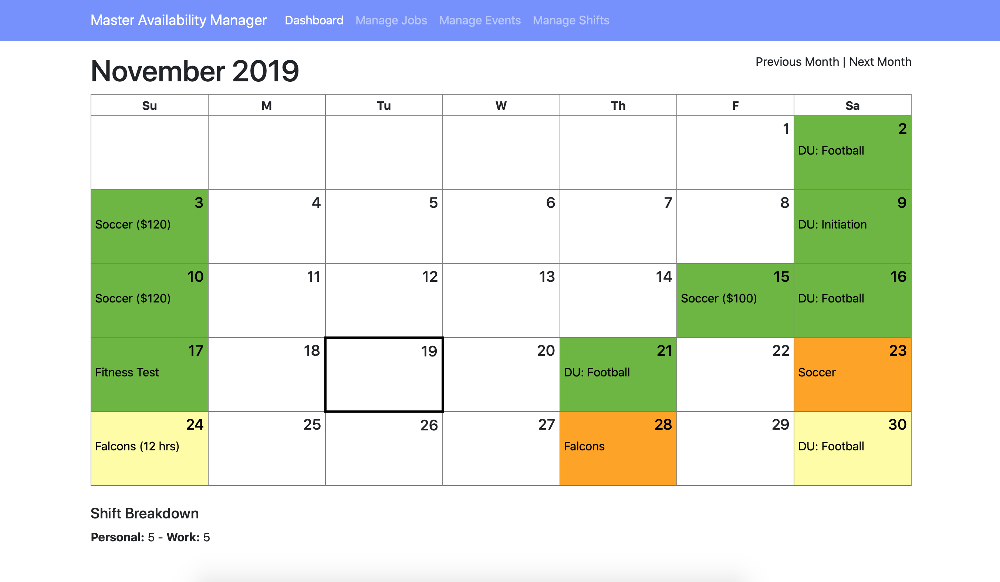

# Master Availability Manager
##### A system that helps you manage your availability for multiple jobs

## How it works
First, setup all of your jobs under the `Manage Jobs` tab
    I recommend creating a job called "Personal" with an hourly wage of $0.00 for days when you have a personal commitment or other reason why you can't work
Second, under `Manage Events`: enter all the upcoming events that you have (each event is associated with a job)
Third, under `Manage Shifts`: create shifts for all the events that you have committed to attending/working.
    You can leave them as `Unconfirmed` and they will be color coded accordingly on the main dashboard.

## Installation
1. Create a new database in your MySQL instance
2. Import the `Example DB.sql` for schema
2. Update the parameters in `config example.ini`
3. Rename `config example.ini` to `config.ini`
4. Place the code on a server capable of running PHP
5. Navigate to the `public` directory to access the website

## `.ics` Feed
You can now also get an ICS feed of when you will be studying what. Simply try to add `https://YOUR_DOMAIN/PATH/feed.ics` as a remote calendar. The `.htaccess` will rewrite the `.ics` to `.php` and everything should work out nicely.

## TODO:
  - Make SSO optional
  - Support managing multiple user's schedules
